# 09-Grahlix-32
# OSINT Exercise

#### Piattaforma: Grahlix
#### Livello: Med/Hard- Easy/Hard
#### Date: 2026/01/28
#### Link: https://gralhix.com/list-of-osint-exercises/osint-exercise-032/

## Obiettivo
### 1. Determine the exact date and time when the video was recorded.
### 2. Identify the airport and the terminal where the TV screen was located.

## Informazioni iniziali
#### - Airports are global hubs where cultures, languages, and lives briefly intersect. Millions of people pass through them each day. On an undisclosed date and at an unknown location, one of these travellers recorded a TV screen for 28 seconds. The video can be found below.

#### - https://www.youtube.com/watch?v=rK9k2Cfe8wo

## Passaggi
1. Innanzitutto guardo i metadati del video (https://mattw.io/youtube-metadata/), il cui upload è stato fatto il 2025-07-10T21:12:53Z, quindi sicuramente è stato girato prima del 10 luglio 2025
2. Nel serpentone in basso c'è questa frase in inglese: 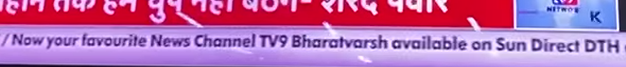 pare quindi che il canale sia TV9 Bharatvarsh
3. E' un canale indiano: https://www.tv9hindi.com/ quindi probabilmente ci troviamo in India
4. Nelle immagini ci sono dei caccia militari e una persona con faccia disperata (Zelensky?)
5. Ecco la traduzione: 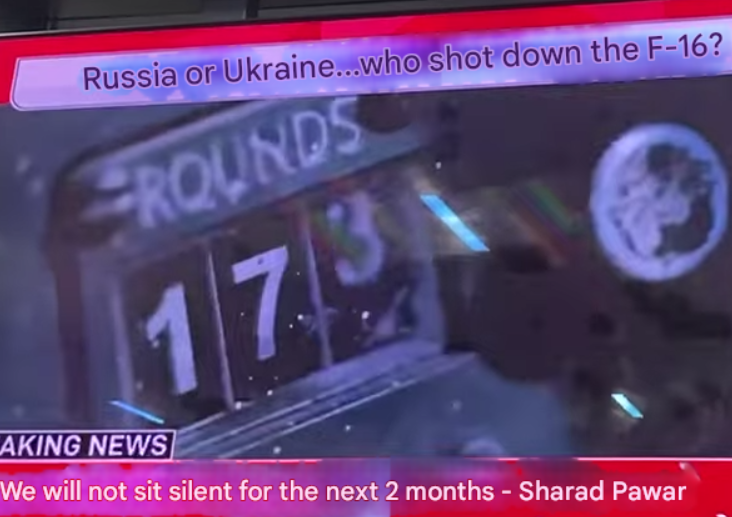 quindi il servizio è su una discussione tra Russia e Ucraina ma la breaking news in basso eè su questo Sharad Pawar
6. La prima traduzione invece è questa: 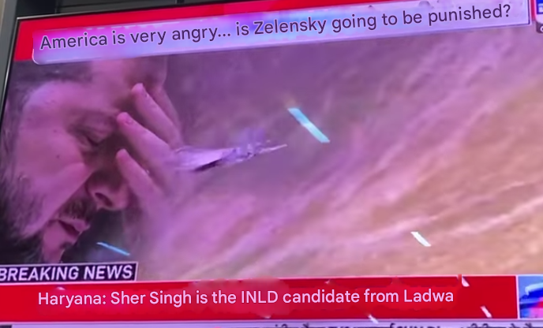
7. In alto c'è un orario: 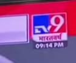 quindi il video è stato fatto alle 21:14 (India time?), quindi basta trovare il giorno
8. Altra schermata: 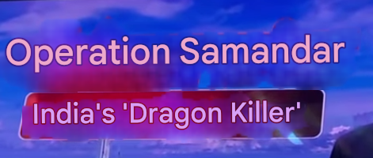
9. 
10. By the way: OGGI è morto il nipote di Sharad Pawar, Ajit Pawar: 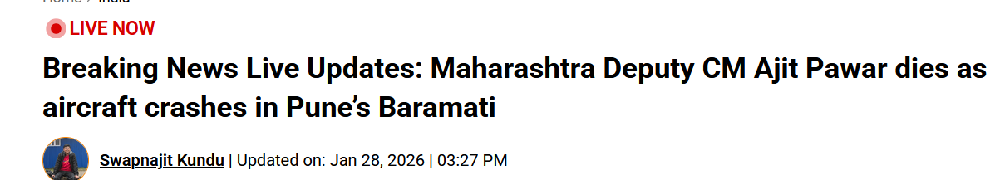
11. No words: il nipote si era ribellato, magari sta parlando di quello? 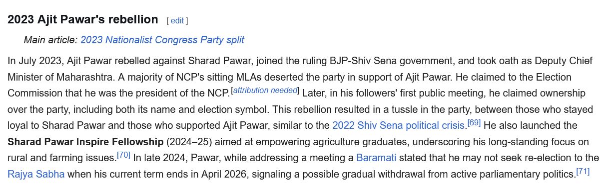
12. https://en.wikipedia.org/wiki/2023_Nationalist_Congress_Party_split
13. https://en.wikipedia.org/wiki/Indian_National_Lok_Dal 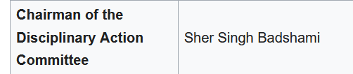 Sarà lui? candidato a ladwa
14. Cercando su google la frase sui due mesi di sharad pawar ho trovato questo: https://www.ndtv.com/india-news/wont-sit-quietly-till-maharashtra-government-is-changed-in-2-months-sharad-pawar-6468489 del 1 settembre 2024, parla di una statua distrutta, e dice che la citazione è di Domenica
15. 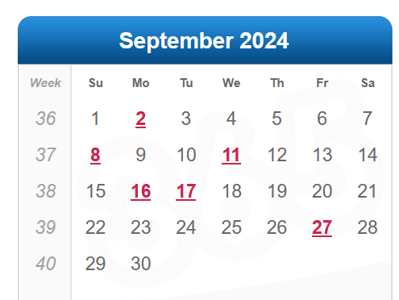 Domenica era il 01 settembre 2024, quindi potrebbe essere il giorno in cui è stato girato, verifichiamo
16. Cercando f-16 russia ukraine after:2024-08-29 before:2024-09-02 su google si trova questo articolo della BBC del 29 agosto 2024: https://www.bbc.com/news/articles/cd0532n9pdko quindi è probabile che la news si riferisse a questo
17. Ho notato che nel sito di TV9 c'è un serpentone breaking news simile a quello della televisione, magari con Wayback Machine riesco a vedere se il 01/09/2024 c'erano quelle frasi
18. Trovata la pagina delle breaking news del 1 settembre completo: 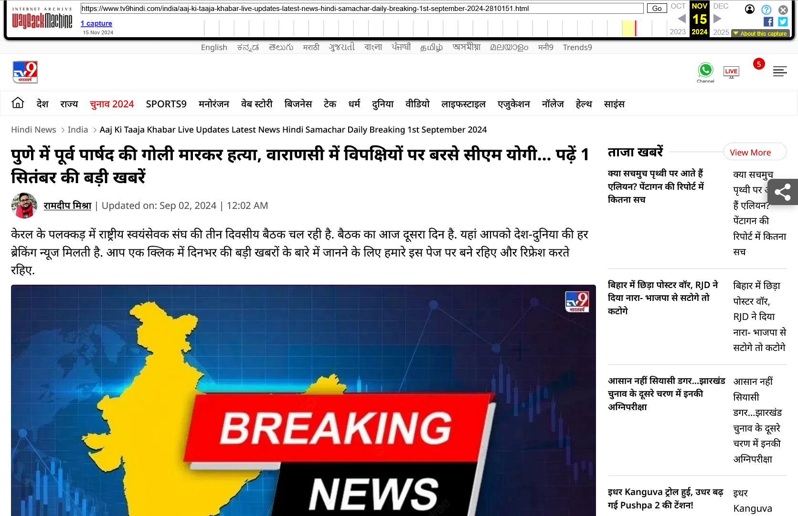
19. Qui niente vediamo nella tab elections se parla di Sher Shing INLD quel giorno- non c'è niente magari riesco a trovare l'articolo da qualche giorno successivo
20. Niente, direi che prendiamo per buono la risposta per 1. 
21. Passiamo alla 2: Il telegiornale è in hindi quindi magari iniziamo a cercare nelle città dove viene parlato l'hindi: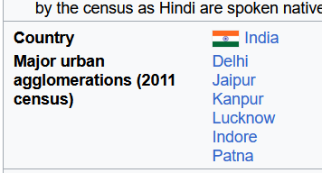
22. Potrebbe essere l'aeroporto di Dehli: 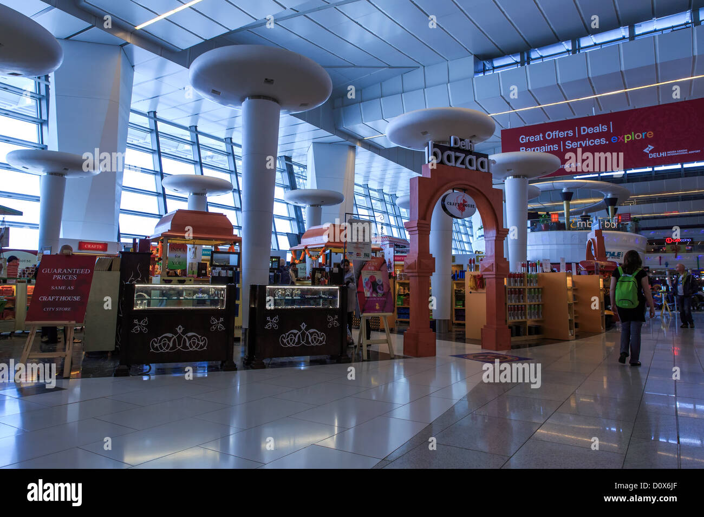 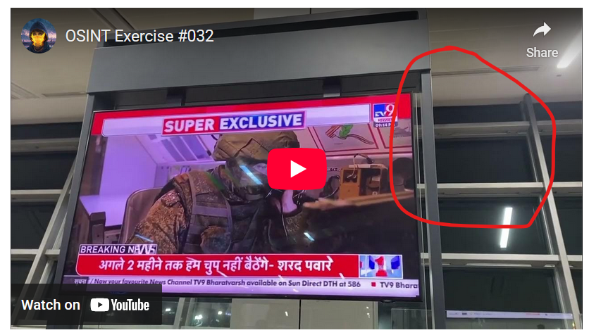
23. Su wikipedia c'è scritto che *Apart from the two budget domestic airlines handled by Terminals 1 and 2, all other airlines operate their flights from Terminal 3. In June 2022, Delhi International Airport became India's first to run entirely on Hydro Power and solar energy* quindi è probabile che sia un temrinal internazionale
24. Sembra che il terminal 3 abbia quelle finestre: 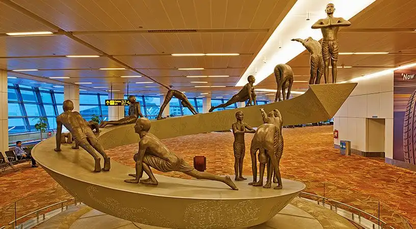

## Risultato / Flag
#### 1. Il 1 Settembre 2024 alle 21.14
#### 2. Therminal 3 Dehli airport

